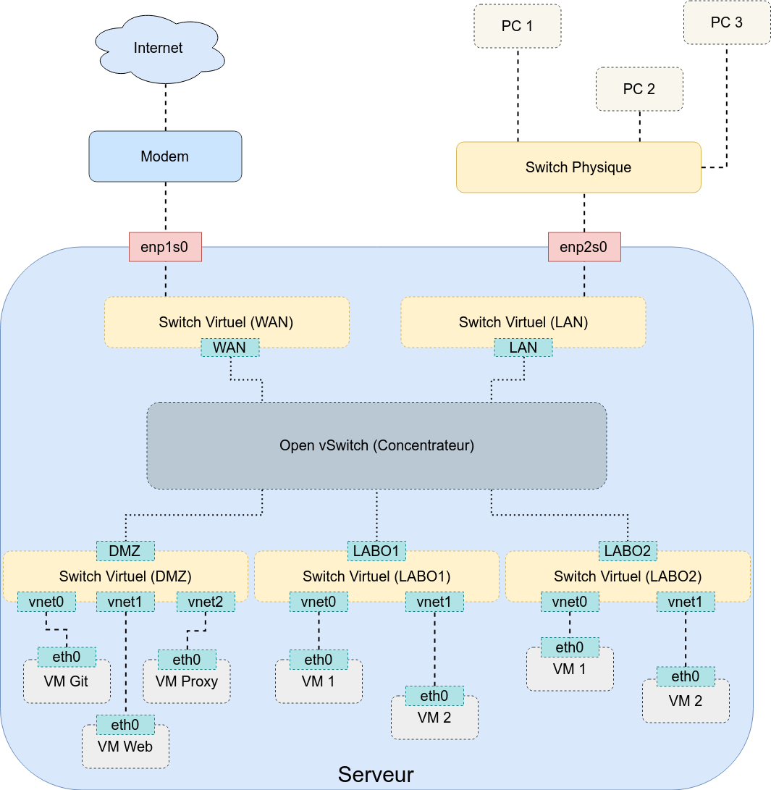

## Lien vers le projet
[Github Zamiel : Script de configuration d'un réseau OvS](https://github.com/Zami3l/linux/tree/master/scripts/ovs)

## Présentation

Ce script à pour but de créer un réseau incluant un WAN, LAN, DMZ et plusieurs sous réseaux de tests.
Ce réseau utilise la technologie [Open vSwitch](https://en.wikipedia.org/wiki/Open_vSwitch) permettant de créer plusieurs commutateurs virtuels.

Le script se base sur l'architecture suivante :

