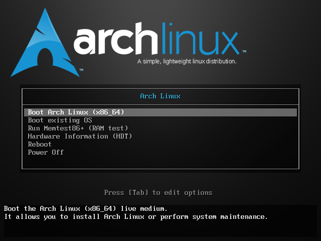
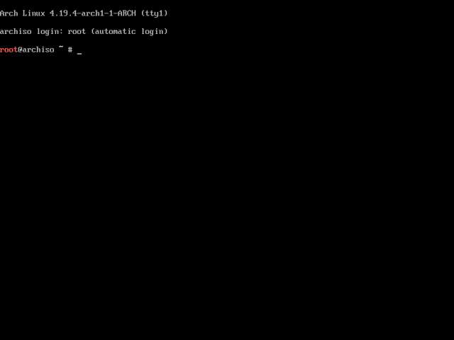
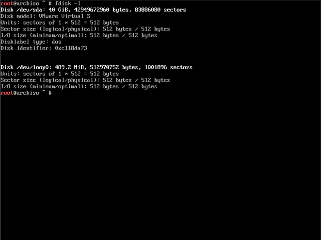
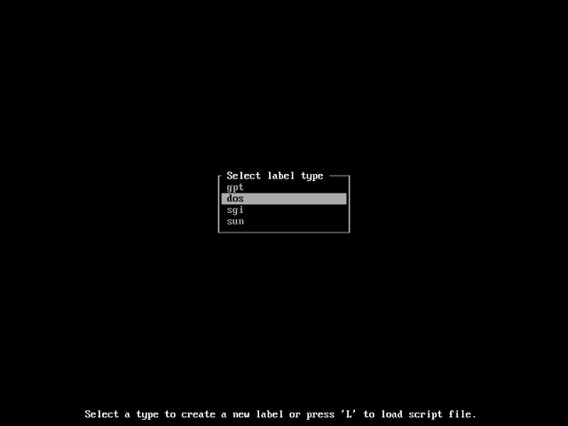
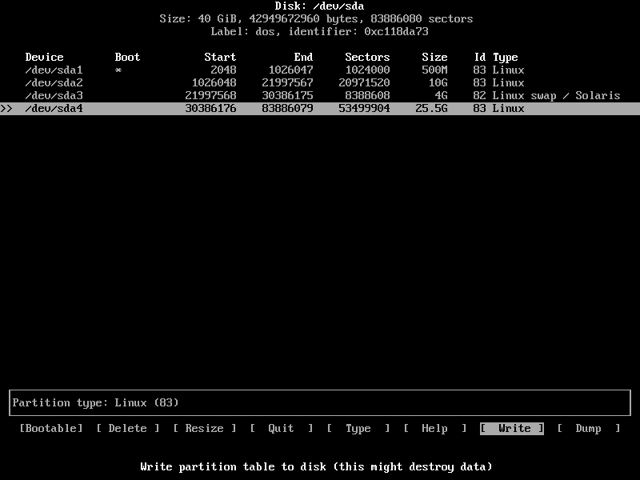
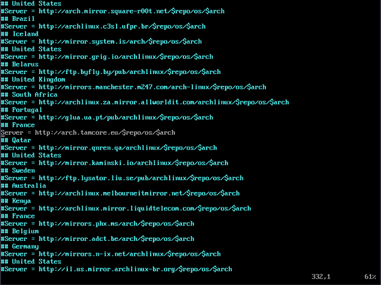

----
## Sommaire

##### [1 - Présentation](#1-Présentation)
##### [2 - Préparation](#2-Préparation)
##### [3 - Partionnement](#3-Partionnement)
##### [4 - Installation](#4-Installation)
##### [5 - Configuration](#5-Configuration)
##### [6 - Fin](#6-Fin)
----

### 1) Présentation
Arch Linux est une distribution légère et rapide dont le concept est de rester la plus simple possible.

Ce tutoriel se veut plus simplifié que l'[original](https://wiki.archlinux.org/index.php/Installation_guide) mais également plus restrictif.
L'installation s'effectuera sur une VM sous Vmware avec une installation de type BIOS (Et non UEFI).
Je pars également du principe que vous maitrisez un minimum VIM, j'expliquerai donc briévement les commandes de modifications.

### 2) Préparation
L'ISO d'Arch se trouve ici : [Arch Linux](https://www.archlinux.org/download/)

### 3) Partionnement

Une fois la VM démarrée, on arrive sur l'écran de démarrage.
On commence par sélectionner "Boot Arch Linux (x86_64)"




Si tout se passe bien, on arrive en CLI sur Arch Linux en root.




On commence par mettre son clavier en français (Qwerty par défaut).
```
loadkeys fr-latin9
```

Ensuite on repère le volume sur lequel nous allons installer Arch.
```
fdisk -l
```

Dans mon cas, mon volume est /dev/sda et est de taille 40G.




Une fois le volume repéré, on lance l'utilitaire de partionnement sur /dev/sda et on le configure avec le type DOS.
```
cfdisk /dev/sda
```




Pour le partionnement, je le configure de la façon suivante :

| Chemin | Bootable | Point de montage | Taille | ID | Type |
| ------ | ------ | ------ | ------ | ------ | ------ |
| /dev/sda1 | * | /boot | 500M | 83 | ext4 |
| /dev/sda2 |  | / | 10G | 83 | ext4 |
| /dev/sda3 |  | | 4G | 82 | swap |
| /dev/sda4 |  | /home | 25.5G | 83 | ext4 | 

Ce qui donnera sur l'utilitaire :




Il faut ensuite partitionner nos volumes ext4 avec les commandes :
```
mkfs.ext4 /dev/sda1
mkfs.ext4 /dev/sda3
mkfs.ext4 /dev/sda4
```

Pour le swap :
```
mkswap /dev/sda2
swapon /dev/sda2
```

On termine par monter nos points de montage :
```
mount /dev/sda3 /mnt
mkdir /mnt/{boot,home}
mount /dev/sda1 /mnt/boot
mount /dev/sda4 /mnt/home
```

### 4) Installation

Maintenant que nous avons préparé nos partitions, on va passer à l'installation.

Il faut dans un premier temps éditer et choisir notre mirroir dans le fichier /etc/pacman.d/mirrorlist
L'édition peut se faire avec nano ou vim. Dans l'exemple, l'édition se fait avec vim et je choisis le mirroir de tamcore.
```
vim /etc/pacman.d/mirrorlist
:%s/Server/#Server/g
-> Touche Entrée
/tamcore
-> Touche Entrée
-> Touche i
On décommente : Server = http://arch.tamcore.eu/$repo/os/Arch
-> Touche ECHAP
:wq
-> Touche Entrée
```




On installe ensuite la base ainsi que quelques outils :
```
pacstrap /mnt base base-devel
pacstrap /mnt bash-completion vim
```

Maintenant que la base est installée, il faut générer les partitions dans le fstab :
```
genfstab -U -p /mnt >> /mnt/etc/fstab
```

Et installer le lanceur :
```
pacstrap /mnt grub os-prober
```

### 5) Configuration

Une fois l'installation terminé, on va préparer notre environnement.
Pour cela, on accède à Arch via :
```
arch-chroot /mnt
```

On configure le fuseau horaire,
```
ln -sf /usr/share/zoneinfo/Europe/Paris /etc/localtime
```

L'horloge matérielle,
```
hwclock --systohc --utc
```

La langue du système en décommentant la ligne fr_FR.UTF-8 UTF-8
```
vim /etc/locale.gen
/fr_FR
-> Touche Entrée
-> Touche i
On décommente la ligne : fr_FR.UTF-8 UTF-8
-> Touche ECHAP
:wq
-> Touche Entrée
```

On charge maintenant la langage paramatrée :
```
locale-gen
```

Pour que la langue soient appliqués par défaut, il faut créer le fichier locale.conf :
```
vim /etc/locale.conf
-> Touche i
LANG=fr_FR.UTF-8
LC_COLLATE==C
-> Touche ECHAP
:wq
-> Touche Entrée
```

Et idem pour que le clavier français avec le fichier vconsole.conf :
```
vim /etc/vconsole.conf
-> Touche i
KEYMAP=fr-latin9
-> Touche ECHAP
:wq
-> Touche Entrée
```

On indique ensuite le nom de l'hôte :
```
vim /etc/hostname
-> Touche i
hostname
-> Touche ECHAP
:wq
-> Touche Entrée
```

Et la configuration network de l'hôte :
```
vim /etc/hostname
-> Touche i
127.0.0.1	localhost
::1		localhost
127.0.1.1	hostname.localdomain	hostname
-> Touche ECHAP
:wq
-> Touche Entrée
```

Il ne nous reste plus qu'à configurer l'image du noyau
```
mkinitcpio -p linux
```

A paramétrer le mot de passe root
```
passwd
```

Installer le grub sur le volume ou est installé Arch
```
grub-install --no-floppy --recheck /dev/sda
```

Et à générer (sans erreur...) le lanceur
```
grub-mkconfig -o /boot/grub/grub.cfg
```

### 6) Fin
Vous avez terminé de préparer, installer et configurer Arch Linux, Bien joué !
Il ne vous reste plus qu'à quitter, démonter et redémarrer.
```
exit
umount -R /mnt
reboot
```

Enjoy with Arch Linux