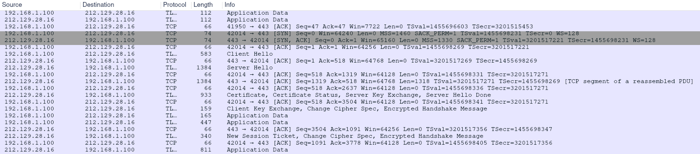

# Handshake TLS - Protocole TLS

Ce protocole permet au serveur et au client de s'authentifier entre eux, puis de négocier un algorithme de chiffrement et une clé cryptographique avant l'échange de données.

Il fonctionne de la façon suivante :


## 1. Etablissement de la connexion
Le client initie la communication avec le serveur en envoyant un message SYN (Synchronize). Le serveur accepte la communication en envoyant un message SYN-ACK (synchronize-acknowledgment). Enfin, le client informe le serveur de la bonne réception du message reçu en envoyant un ACK (acknowledgment).

## 2. Négociation
Le client informe au serveur qu'ils doivent communiquer via SSL. Il inclut le numéro de version SSL, les paramètres de chiffrement, les données spécifiques de la session.

Le serveur répond au client avec la version de TLS du client, l’identifiant de session et la plus forte suite d’algorithme commune entre le client et le serveur.

/!\ Si la version TLS ou la suite d’algorithmes proposés par le client ne sont pas disponibles côté serveur, la communication s’interrompt. /!\

## 3. Authentification du client et génération de la clé de session
Une fois les algorithmes négociés, le serveur envoie également sa clé publique au client pour chiffrer la clé de session (Server Key Exchange). En fonction de la configuration du serveur, il envoie le message Client Certificate Request afin de demander au client son propre certificat.

Le client vérifie le format du certificat, sa date d’expiration, son statut révoqué ou non et si le certificat est de confiance.

Enfin, le serveur envoie le message Server Hello Done pour indiquer qu’il a terminé.

## 4. Fin du Handshake TLS
Le client et le serveur échangent des messages pour s'informer mutuellement que les futurs messages seront chiffrés.  
<br>
___
<br>

## Exemple d'échanges avec root-me.org



### Client Hello :

```
Transport Layer Security
    TLSv1.2 Record Layer: Handshake Protocol: Client Hello
        Content Type: Handshake (22)
        Version: TLS 1.0 (0x0301)
        Length: 512
        Handshake Protocol: Client Hello
            Handshake Type: Client Hello (1)
            Length: 508
            Version: TLS 1.2 (0x0303)
            Random: ed76a8798174559[...]ae35306b71c09
            Session ID Length: 32
            Session ID: dbe4847e1a718[...]3dc10d49217b
            Cipher Suites Length: 32
            Cipher Suites (16 suites)
            Compression Methods Length: 1
            Compression Methods (1 method)
            Extensions Length: 403
            [...]
```


### Serveur Hello :

```
TLSv1.2 Record Layer: Handshake Protocol: Server Hello
    Content Type: Handshake (22)
    Version: TLS 1.2 (0x0303)
    Length: 82
    Handshake Protocol: Server Hello
        Handshake Type: Server Hello (2)
        Length: 78
        Version: TLS 1.2 (0x0303)
        Random: 31d364[...]0f0f882986
        Session ID Length: 0
        Cipher Suite: TLS_ECDHE_RSA_WITH_AES_128_GCM_SHA256 (0xc02f)
        Compression Method: null (0)
        Extensions Length: 38
        [...]
```


### Client Key Exchange, Change Cipher Spec, Encrypted Handshake Message :

1. Certificate (optionnel)  
Envoi d’une chaîne de certificats par le serveur. Le premier certificat est celui du serveur, le dernier est celui de l’autorité de certification.

```
Transport Layer Security
    TLSv1.2 Record Layer: Handshake Protocol: Certificate
        Content Type: Handshake (22)
        Version: TLS 1.2 (0x0303)
        Length: 2557
        Handshake Protocol: Certificate
            Handshake Type: Certificate (11)
            Length: 2553
            Certificates Length: 2550
            Certificates (2550 bytes)
```

2. Certificate Request (optionnel)  
Demande un certificat au client pour l’authentifier.

```
Transport Layer Security
    TLSv1.2 Record Layer: Handshake Protocol: Certificate Status
        Content Type: Handshake (22)
        Version: TLS 1.2 (0x0303)
        Length: 535
        Handshake Protocol: Certificate Status
            Handshake Type: Certificate Status (22)
            Length: 531
            Certificate Status Type: OCSP (1)
            OCSP Response Length: 527
            OCSP Response
```

3. Server Key Exchange (optionnel)   
Message complémentaire pour l’échange des clés. Ce message contient la clé publique du serveur utilisée par le client pour chiffrer les informations de clé de session.

```
Transport Layer Security
    TLSv1.2 Record Layer: Handshake Protocol: Server Key Exchange
        Content Type: Handshake (22)
        Version: TLS 1.2 (0x0303)
        Length: 300
        Handshake Protocol: Server Key Exchange
            Handshake Type: Server Key Exchange (12)
            Length: 296
            EC Diffie-Hellman Server Params
```

4. Server Hello Done

```
Transport Layer Security
    TLSv1.2 Record Layer: Handshake Protocol: Server Hello Done
        Content Type: Handshake (22)
        Version: TLS 1.2 (0x0303)
        Length: 4
        Handshake Protocol: Server Hello Done
            Handshake Type: Server Hello Done (14)
            Length: 0
```


### Client Key Exchange, Change Cipher Spec, Encrypted Handshake Message :

1. Client Key Exchange  
Le client produit un secret pré-maître (encrypted pre-master key) et le crypte avec la clé publique du certificat du serveur. Ces informations sont chiffrées une deuxième fois avec la clé publique du serveur (et non la clé publique du certificat du serveur) reçue dans le message Server Key Exchange.
```
Transport Layer Security
    TLSv1.2 Record Layer: Handshake Protocol: Client Key Exchange
        Content Type: Handshake (22)
        Version: TLS 1.2 (0x0303)
        Length: 37
        Handshake Protocol: Client Key Exchange
            Handshake Type: Client Key Exchange (16)
            Length: 33
            EC Diffie-Hellman Client Params
```
2. Change Cipher Spec  
Passage du client en mode chiffré avec la clé master comme clé symétrique.

```
Transport Layer Security
    TLSv1.2 Record Layer: Change Cipher Spec Protocol: Change Cipher Spec
        Content Type: Change Cipher Spec (20)
        Version: TLS 1.2 (0x0303)
        Length: 1
        Change Cipher Spec Message
```
3. Client Finished  
Fin des émissions du client, ce message est chiffré à l’aide des paramètres de la suite de chiffrement.

```
Transport Layer Security
    TLSv1.2 Record Layer: Handshake Protocol: Encrypted Handshake Message
        Content Type: Handshake (22)
        Version: TLS 1.2 (0x0303)
        Length: 40
        Handshake Protocol: Encrypted Handshake Message
```


### Change Cipher Spec, Encrypted Handshake Message

1. Change Cipher Spec  
Passage du serveur en mode chiffré avec la clé master.

```
Transport Layer Security
    TLSv1.2 Record Layer: Change Cipher Spec Protocol: Change Cipher Spec
        Content Type: Change Cipher Spec (20)
        Version: TLS 1.2 (0x0303)
        Length: 1
        Change Cipher Spec Message
```
2. Server Finished  
Confirmation au client du passage en mode chiffré. Ce message est chiffré à l’aide des paramètres de la suite de chiffrement.

```
Transport Layer Security
    TLSv1.2 Record Layer: Handshake Protocol: Encrypted Handshake Message
        Content Type: Handshake (22)
        Version: TLS 1.2 (0x0303)
        Length: 40
        Handshake Protocol: Encrypted Handshake Message
```

3. Encrypted Data  
Le tunnel SSL / TLS est établi, c’est maintenant le Record Protocol qui prend le relais pour chiffrer les données.